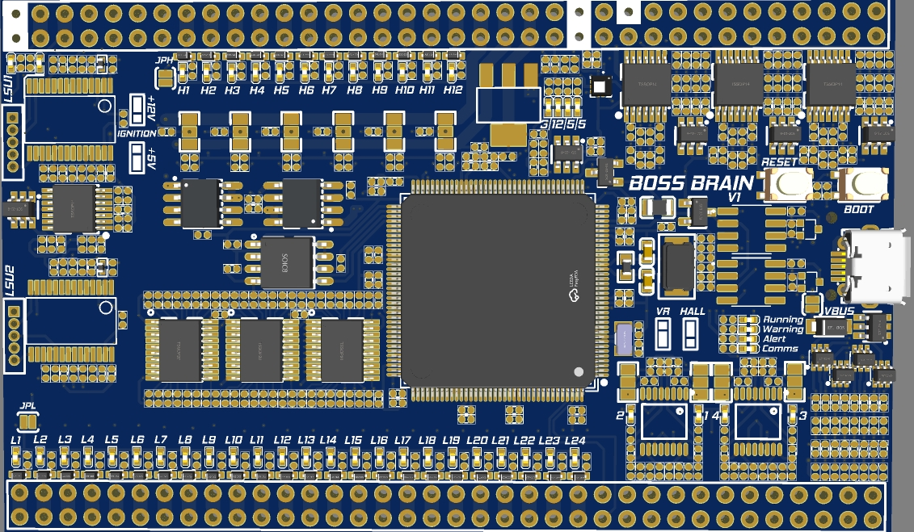

  

---

# BossECU Brain Custom Firmware

This repository provides custom firmware for standalone ECUs that integrate with the **BossECU Brain module**.

  

---

## Latest Firmware Releases

Find and download the most recent firmware versions on our dedicated [**release page**](https://github.com/bossthetuga/BossECU-Brain/releases).

---

## Supported ECU Models

Our custom firmware supports a wide range of BossECU and Honduino models. Ensure you select the correct version for your specific ECU.

### BossECU Series:

| ECU Model             | Version |
| --------------------- | ------- |
| [**BossECU BMW M1.7**](https://bossgarage.eu/en/products/bossecu-bmw-m1-7) | V1      |
| [**BossECU BMW M3.1**](https://bossgarage.eu/en/products/bossecu-bmw-m3-1) | V1      |
| [**BossECU Nissan S13X**](https://bossgarage.eu/en/products/boss-ecu-s13x) | V3      |
| [**BossECU Nissan S15X**](https://bossgarage.eu/en/products/boss-ecu-s15x) | V1      |
| [**BossECU PSA NFX**](https://bossgarage.eu/en/products/bossecu-psa-nfx) | V1      |
| [**BossECU PSA NFW**](https://bossgarage.eu/en/products/bossecu-psa-nfw) | V1      |
| [**BossECU Suzuki Vitara 48p**](https://bossgarage.eu/en/products/bossecu-suzuki-vitara-48p) | V1      |

### Honduino Series:

| ECU Model           | Version   |
| ------------------- | --------- |
| [**Honduino OBD0**](https://bossgarage.eu/en/products/honduino-obd0) | V1 - V1.1 |
| [**Honduino OBD1**](https://bossgarage.eu/en/products/honduino-obd1) | V4 - V4.4 |
| [**Honduino OBD1 DPFI**](https://bossgarage.eu/en/products/honduino-obd1-dpfi) | V1        |
| [**Honduino OBD2 DPFI**](https://bossgarage.eu/en/products/honduino-obd2-dpfi) | V5        |
| [**Honduino OBD2A**](https://bossgarage.eu/en/products/honduino-obd2a) | V1        |
| [**Honduino OBD2B**](https://bossgarage.eu/en/products/honduino-obd2b) | V1        |
| [**Honduino K**](https://bossgarage.eu/en/products/honduino-k) | V1        |
