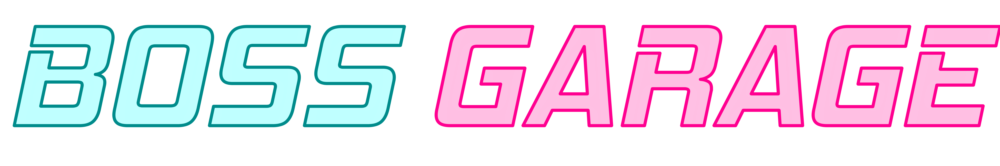
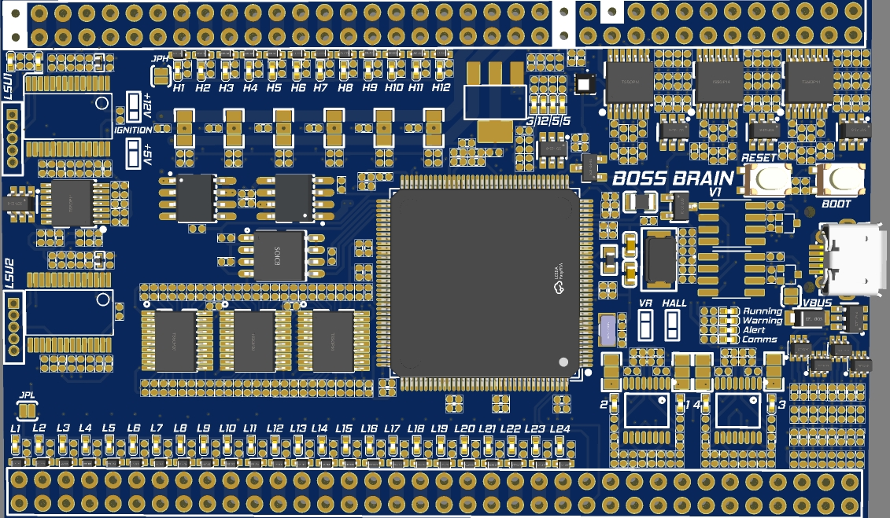

  

---

# BossECU Brain Custom Firmware

This repository provides custom firmware for standalone ECUs that integrate with the **BossECU Brain module**.

  

---

## Latest Firmware Releases

Find and download the most recent firmware versions on our dedicated [**release page**](https://github.com/bossthetuga/BossECU-Brain/releases).

---

## Supported ECU Models

Our custom firmware supports a wide range of BossECU and Honduino models. Ensure you select the correct version for your specific ECU.

### BossECU Series:

| ECU Model             | Version |
| --------------------- | ------- |
| **BossECU BMW M1.7** | V1      |
| **BossECU BMW M3.1** | V1      |
| **BossECU Nissan S13X** | V3      |
| **BossECU Nissan S15X** | V1      |
| **BossECU Suzuki Vitara 48p** | V1      |

### Honduino Series:

| ECU Model           | Version   |
| ------------------- | --------- |
| **Honduino OBD0** | V1 - V1.1 |
| **Honduino OBD1** | V4 - V4.4 |
| **Honduino OBD1 DPFI** | V1        |
| **Honduino OBD2 DPFI** | V5        |
| **Honduino OBD2A** | V1        |
| **Honduino OBD2B** | V1        |
| **Honduino K** | V1        |
